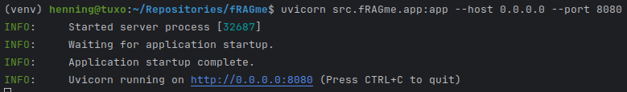
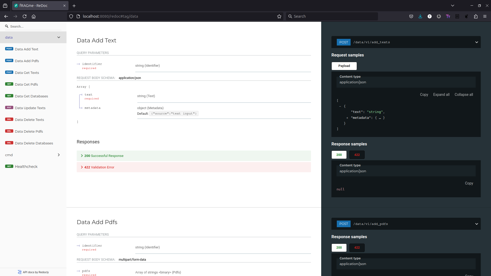

.. _usage:

Usage
============

Use as package from cli
-----------------------

.. code-block:: bash

    $ python -m venv venv
    $ source venv/bin/activate
    (venv)$ pip install fRAGme

    # Call with variables directly
    (venv)$ ORIGIN=* OPENAI_API_KEY=YOUR_OPENAI_API_KEY DATA_PATH="./data" uvicorn fRAGme.app:app --host 0.0.0.0 --port 8080

    # or set with export globally for all variables
    (venv)$ export ORIGIN=*
    (venv)$ export OPENAI_API_KEY=YOUR_OPENAI_API_KEY
    (venv)$ export DATA_PATH="./data"
    (venv)$ export HOST=0.0.0.0
    (venv)$ export PORT=8080
    (venv)$ uvicorn fRAGme.app:app --host $HOST --port $PORT

OpenApiSpec(OAS)
----------------

.. image:: _static/images/fastapi_docs.png
  :width: 1200
  :alt: OpenAPISpec(OAS).

ReDoc
-----

